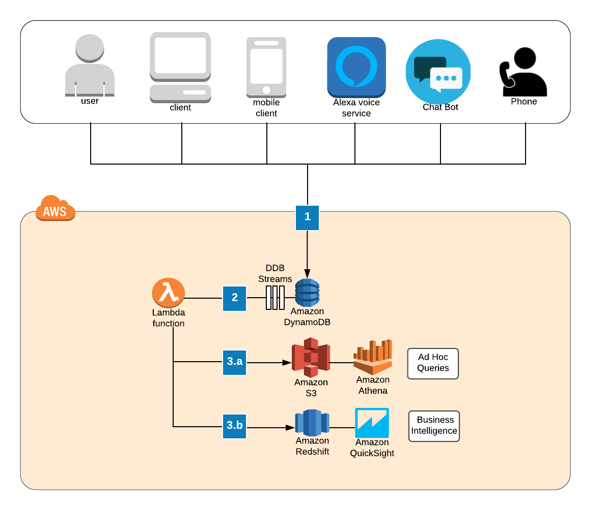

# How to Deploy a Machine Learning Risk Classification Model with Amazon AWS

In this article I am going to walk you though a high-level example of how to deploy a machine learning model using Amazon Web Services (AWS). The beauty of using AWS is that all of their servces are par-per-use with extremely competative rates. For a data scientist just playing around and learning the AWS suite of services, there are many ways to implement model deployment architectures at minimal cost. 

## Example Use Case: Risk Modeling with Application Data 

The architecture I am proposing in this article is based upon a use case where a company (lets call them Company X) collects a lot of user or application data coming from various sources. Below are all the ways in which Company X collects application data: 

* __Webform__: Company X has a website where users log-in, create a profile, and fill out a webform application directly on the website. This is the most common method applicats use. 
* __Mobile App__: Since there are more people in the world with a mobile phone than a computer, Company X decided to develop a mobile app service. This is a very popular choice among their younger applicants.  
* __Chat Bot__: Company X also has a chatbot service deployed on their website. Applicants submit their information to a bot agent via a chat dialog. The bot agent collects applicant information and provides an interface for answering commonly asked questions thoughout the application process. 
* __By Phone__: Applicants can phone in their application to a call center that utilizes both live agents and voice-bot agents. Voice-bot agents collect the bulk of the applicant data, but there are also live agents available to assist.
* __By Mail__: Applicants also have the option of printing out and submitting a paper application. The paper application data is then manually entered into the back-end system for processing. Very few people use this option. 

At Company X, applicant data is ingested and temporarily stored in a DynamoDB NoSQL database. Database entries are streamed to a rules-based function that decides to either 1) rejects the applicant based on a set of pre-defined rules, or 2) forward the application to an auditor who will manualy accept or reject the applicant. Below is a diagram showing how the data flows through the business. 

#### Sample Architecture for Data Ingestion with Cloud Hosted Analytics on AWS

## Step 1) Architect the Data Ingestion Pipeline using API Gateway
API Gateway is an easy and secure way to monitor and maintain your data ingestion process. Its a pay-per-use service that keeps track of all your API communication and has a gloabal reach. You can set up an API Gateway to recieve data from all of your data ingestion touchpoints. Mobile and desktop clients, IoT devices, and bot services in voice, phone, and text are all sources of data that you can incoprorate into your data ingestion architecture. 

 -- use case example --

## Step 2) Build a Model & Launch an Endpoint in SageMaker

## Step 3) Create ETL Functions in Lambda

## Step 4) Use DynamoDB as an Intermediate Database

## Step 5) Create Routing Functions in Lambda

## Risk Modelling Use Cases

Risk modelling can be applied to many industries and in many different scenarios. Any time a company is interested in managing a particular outcome there is an opportunity to apply machine learning and advanced analytics to measure and predict the result. 

Risk modelling applies across a variety of industries. Some common use cases are:

* Financial Risk: The risk of defaulting on a loan or losing money in an investment. A bank wants to know the risk of issuing a loan to a business or individual where an investment firm would be more focused on stock portfolio risk, or the risk of investing in a particular stock or fund. 
* Insurance Risk: Health insurance, life insurance, auto insurance, and home-owners insurance companies are all interested in measuring an individual's contribution and risk to their portfolio of products. These companies are asking, What is the risk of insuring this person? What is the appropriate product we should offer this person and at what price?
* Business Risk: The risk of losing a customer (customer churn) or retaining an employee (employee retention) is a well known use case. This can also be extended to education to measure the risk of a student dropping out or failing to graduate. 
* Safety Risk: The risk of injury or death such as in hospitals and clinics. If you are a hospital or a group of doctors, you are interested in knowing the mortality risk of patient given their diagnosis and treatment response data. 

## 

## The Benefits of using Amazon SageMaker Model Endpoints

There are many benefits of using Amazon SageMaker to manage your model endpoints. The service is __fully managed__, meaning Amazon will take care of a number of tasks associated with provisioning a model into production and optimizing the required infracture according to your needs. 
 - [Inference Pipelines](https://docs.aws.amazon.com/sagemaker/latest/): Models are most often not standalone entities, but ensembles and stacks of data transformed multiple times over before the final result is infered. SageMaker  provides an easy way to orchistrate multiple inferences and transformations into a single pipeline.
 - [Auto Scaling](https://docs.aws.amazon.com/sagemaker/latest/dg/endpoint-auto-scaling.html): Set a CloudWatch alarm to trigger additional computing power by spinning up additional EC2 instances when you get a spike in model inference calls. This helps if you are interested in making real-time inferences and you have an unpredictible request load. 
 - [Elastic Inferece (EI)](https://docs.aws.amazon.com/sagemaker/latest/dg/ei.html): Do you have a computationally heavy model inference but don't like the high cost of hosting your endpoint on a GPU? Amazon EI is a service that will speed up the throughput of your deep learning models by provisioning an "accelerator" compute resource at the time the model is called. In many cases you can ditch the GPU.
 - [Neo](https://docs.aws.amazon.com/sagemaker/latest/dg/neo.html): Neo can optimize your model across TensorFlow, Apache MXNet, PyTorch, ONNX, and XGBoost for deployment on ARM, Intel, and Nvidia processors. Train your model once and use it anywhere. 

Using SageMaker __promotes transparancy and collaboration__ by centralizing model development activities on a single platform. If you are a manager or owner and you are interested in monitoring your Data Science team's activities and utilization, then using SageMaker in conjunction with [IAM](https://aws.amazon.com/iam/), [CloudWatch](https://aws.amazon.com/cloudwatch/) and [CloudTrail](https://aws.amazon.com/cloudtrail/) can give you insights into what data is being accessed, who (or what) is accessing that data, and how much these activities costing. 

If you are a Data Scientist, you will appreciate how easy it is to organize, annotate, and share your work with colleagues and managers by using the built-in jupyter notebooks. The environment you configure in the notebook stays in the cloud, making it easy to pick up where you left off or collaborate on a model without having to deal with environment configurations. 

## About ELE.ai

